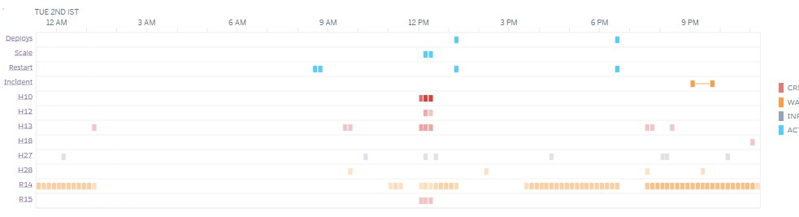
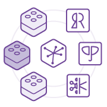

# Heroku Dyno Monitoring & Alerting

**Your Cloudwatch for Heroku. Monitor dyno errors and performance across all your heroku apps and take automated actions!**

[](https://www.python.org/dev/peps/pep-0008/)
[](./LICENSE.md)



## Table of Contents

- [Motivation](#motivation)
- [Features](#features)
- [Quick Start](#quick-start)
- [Local Setup](#local-setup)
- [FAQs](#faqs)
- [Contributors](#contributors)
- [License](#license)


## Motivation

This simple python / django application is aimed towards making the post-deployment lifecycle easy and automated for the end users. Here are the main use-cases we came across that motivated us to build this app:

- **Elusive Dyno Level Errors**  
  Heroku dyno level errors (`R13`, `R14`, `H12`, `H10`) are *not easy to capture* as they show up only in application logs and the metrics dashboard but they heavily impact app performance
- **Memory Leaking Applications**  
  You may have an app that is *leaking memory* and you do not have the bandwidth or the need to identify the source of the leak. A quicker fix can be to *restart the dyno* when its RAM quota exceeds
- **Watchdog**  
  A watchdog app constantly looks at the status of your critical web services, or databases so that you are *alerted in case of SOS*. An ideal watchdog takes automated corrective actions
- **Dyno Metrics**  
  Heroku outputs dyno metrics like `%CPU` and `memory` when you enable them, but this data is *not accessible in a queryable format* for later analysis


## Features

In its final form, the monitoring suite will contain the following:

#### Error Monitoring

- :heavy_check_mark: Monitor and catch **Generic Dyno Errors** (R13, R14 memory errors and other Rxx errors). You can configure the Rxx Error Rules from the admin interface
- :heavy_check_mark: Monitor and catch **Web Specific Dyno Error** (H12, H13, H18 and other Hxx errors). Configuration via admin interface
- :hourglass_flowing_sand: Monitor **Web Dyno Failed Requests** (5xx errors)

#### Alerting

- :heavy_check_mark: **Email alerts** Setup email by entering your SMTP server details and recipients. Then configure your alert rules from the admin dashboard
- :hourglass_flowing_sand: **SMS alerts** Configure SMS alerts by entering your Infobip SMS provider details. If you use some other service (twilio, msg91 etc) you can easily plugin your own implementation

#### Actions

- :heavy_check_mark: **Restart actions** Perform basic recovery actions like dyno restart or app restart when a certain alert is breached

#### Status Checks

- :soon: **Web server** up / down status checks. Specify the *endpoint* to check, *frequency* and *timeout*
- :soon: **Redis instance** availability status checks. Specify *redis url*, *list* name & *threshold* (for list / queue length monitoring if required), *frequency* and *timeout*
- :soon: **Postgres instance** availability status check. Specify the *database url*, *table* name (to check for existence if required), *frequency* and *timeout*

#### Metrics Collection

- :soon: **RAM usage** metric per dyno type. Collection and logging
- :soon: **Load %CPU** per dyno type. Collection and logging

> Metrics Collection only applies to dynos that have metrics logging enabled

## Quick Start

#### Deploy to Heroku

To quickly get started and test the app, you can deploy this application on your heroku account servers. Fill up the pre-requisite environment variables and your app should be up within 5 minutes

[](https://heroku.com/deploy?template=https://github.com/carnot-technologies/dyno-monitor/tree/master)

Post deployment the app
- auto-detects all existing heroku apps and dynos in your account
- makes the admin interface available at `https://<your-app-name>.herokuapp.com/admin/`

#### Configure the Environment

- Required environment variables
  - `HEROKU_API_KEY` - To access the logs from different heroku apps in your account
  - `DJANGO_SUPERUSER_USERNAME`, `DJANGO_SUPERUSER_PASSWORD`, `DJANGO_SUPERUSER_EMAIL` - Superuser credentials to access admin interface   


- Configure emails (optional)
  - `ENABLE_EMAILS` 0: disable (default), 1: enable
  - `EMAIL_HOST` Example **email-server.abc.com**
  - `EMAIL_PORT` Example **587**
  - `EMAIL_HOST_PASSWORD` SMTP password
  - `EMAIL_HOST_USER` SMTP username
  - `SERVER_EMAIL` or the sender's email
  - `RECIPIENTS` list of recipient email addresses in comma seperated format (no spaces) Example: **admin.one@abc.com,admin.two@abc.com**

#### Add Rules & Actions

- Login to the admin panel - it will be located at `https://<your-app-name>.herokuapp.com/admin/`
- You should see `apps` and `dynos` auto-detected from your heroku account
- You can now start adding rules!
- To detect and act on an `R14` error on a certain dyno, add an `Rxx Error`
  - Pick the **dyno** on which you want to apply the error
  - Pick the error **category**. In our case `R14`
  - Enter the **least count** which is the minimum number of occurrences required for the rule to be considered breached, within the **time window** number of seconds
  - Check **email alert** if you want email alerts (Requires mail to be configured)
  - Pick the **action** to be taken when the alert condition is breached. Possible options are `no-action`, `restart-dyno` and `restart-app`
- Save the rule and you are **done!**

> For email sending per topic (app:dyno:error category), a cooling period applies which can be configured from the `EMAIL_COOLING_PERIOD_PER_TOPIC` environment variable   
> Also for app restart and dyno restart actions respective cooling periods apply. They can be configured via `APP_RESTART_COOLING_PERIOD` and `DYNO_RESTART_COOLING_PERIOD` respectively


## Local Setup

This is a django based application. You need the following:
- `Python 3` - we have verified it on Python 3.6
- `virtualenv` - or similar program to manage your virtual environment
- `postgres` - small instance. RAM required less than 1GB
- `redis` - small instance less than 25 MB storage

#### Configure the environment

- Create a virtual environment and install all dependencies
  ```bash
  pip install -r requirements.txt
  ```


- Add environment variables
  - [Required environment variables](#configure-the-environment)
  - `DATABASE_URL` containing the URL of your postgres database
  - `REDIS_URL` containing the URL of your redis instance  


- Ensure you are able to run the server using
  ```bash
  # Dev server
  python manage.py runserver
  # Deployment server
  gunicorn dynomonitor.wsgi
  ```

#### Initial setup scripts

- Run the initialization script as follows:
  ```bash
  bash initialize.sh
  ```
  It will
   - create tables in postgres,
   - setup the superuser account and
   - auto-detect your heroku apps and dynos


- (Optional) You can create another superuser using:
  ```bash
  python manage.py createsuperuser
  ```

- (Optional) You can rerun auto detection of heroku apps too:
  ```bash
  python manage.py shell --command="from utils.rule_helper import auto_detect_heroku_apps; auto_detect_heroku_apps()"
  ```

- Finally, run the server again, and access the admin interface at `http://127.0.0.1:8000/admin` from your browser

#### Done!
If you want to add more features or notice a bug, feel free to report them as **[issues](https://github.com/carnot-technologies/dyno-monitor/issues)** and **[create PRs](https://github.com/carnot-technologies/dyno-monitor/pulls)**. Your contributions are welcome!


## FAQs

- **I am not able to deploy to heroku / run the app locally. What should I do?**
    - Please [raise an issue](https://github.com/carnot-technologies/dyno-monitor/issues) and share the error logs you are getting. We will try our best to help :)


- **Which logs are accessed to extract the errors & metrics info?**
    - Please refer this **[wiki](https://github.com/carnot-technologies/dyno-monitor/wiki/Log-access-and-samples)** on log access method and log samples


## Contributors

The following members have actively contributed to the source code and this repository:

- **[Pushkar Limaye](https://github.com/pushkar24)**
- **[Juhi Kulkarni](https://github.com/juhi04)**
- **[Prathamesh Joshi](https://github.com/prathamesh1729)**


## License

[](http://badges.mit-license.org)

- **[MIT license](./LICENSE.md)**
- Copyright (c) 2020 Carnot Technologies Pvt Ltd
